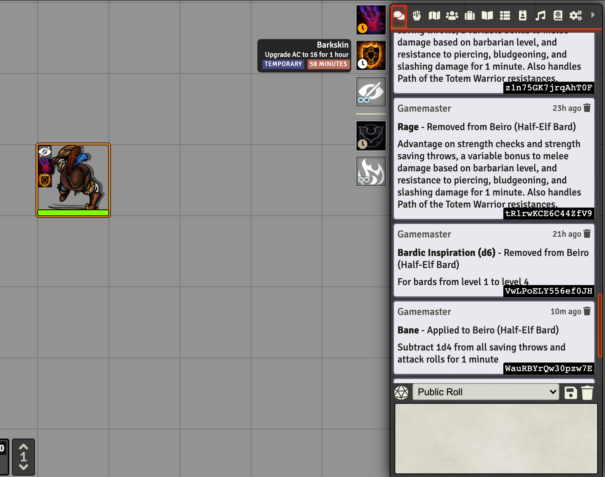
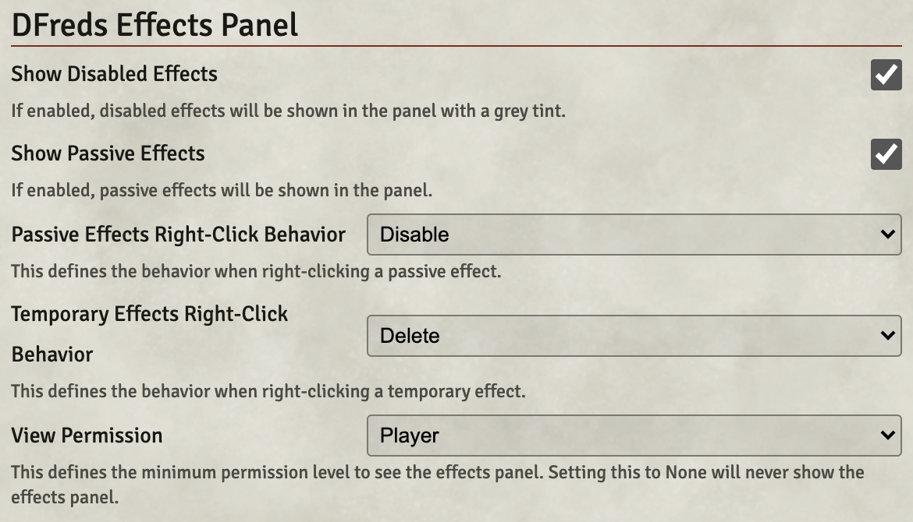

  

<h1 align="center">DFreds Effects Panel</h1>

<h4 align="center">
  <a href="https://foundryvtt.com/packages/dfreds-effects-panel">Install</a>
  ·
  <a href="https://discord.gg/Wq8AEV9bWb">Discord</a>
  ·
  <a href="https://github.com/topics/dfreds-modules">Other Modules</a>
</h4>

    
    
    
     
     
    
    
     
    
    
     
     
    
    
    

    <b>DFreds Effects Panel</b> is a FoundryVTT module that adds a panel of active effects for the selected token.

## Let Me Sell You This

Do you find it annoying to have to open up the character sheet just to see what
effects are applied? Is it annoying to delete them or edit them on the fly?
Well, this module makes that slightly less annoying! Yay...?

## What This Module Does

On selecting a token on the canvas, this module shows a little panel in the top
right of all the currently active effects for that actor. From here, you can do
the following:

- You can hover over the icon to see the name, description (if using DFreds
  Convenient Effects), and the time remaining. This integrates nicely with
  modules that handle time management such as Simple Calendar to show the time
  until it expires. When an effect runs out of time, it will be labeled with
  "Expired".
- You can double click the icon to immediately open the configuration sheet for
  that effect.
- You can configure the behavior when you right click a passive or temporary effect to either
  - Immediately disable the effect
  - Immediately delete the effect
  - Show a dialog to let you pick what to do

You can configure some stuff:

## Required Modules

- [libWrapper](https://foundryvtt.com/packages/lib-wrapper) by ruipin - A
  library that wraps core Foundry methods to make it easier for modules
  developers to do their thang. Note that if you for some reason don't want to
  install this, a shim will be used instead. You'll be pestered to install it
  though so... [just do it](https://www.youtube.com/watch?v=ZXsQAXx_ao0)

## Modules That Help

While not strictly required, the functionalities provided by these modules
drastically improve the usage of the features in this module.

- [DFreds Convenient Effects](https://foundryvtt.com/packages/dfreds-convenient-effects) by DFreds (hey that's me) - Includes a ton of pre-configured effects for the DnD 5e system. It also adds a description box to the active effect config sheet which will be displayed on the effects panel.
- [Simple Calendar](https://foundryvtt.com/packages/foundryvtt-simple-calendar) by vigorator - Handles all your game time management needs
- [Times Up](https://foundryvtt.com/packages/times-up) by tposney - Deletes effects when their time is up or after a certain number of rounds or turns

## This Looks Familiar

If you've ever played the Pathfinder 2e system on Foundry, this module is going
to look very familiar. That is because it almost a straight port of their
feature for doing the same thing. However, now you can have that nice bit of
functionality in any game system!

For obvious reasons, it is not recommended to use this module in conjunction
with the Pathfinder 2e system.
